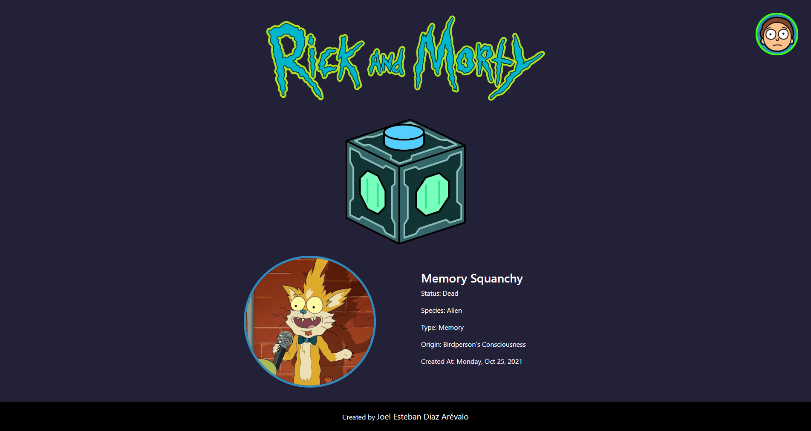
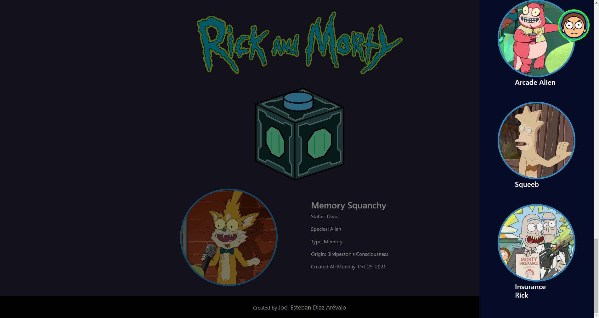

## Rick and Morty Character Generator👽👾
[App Demo here!](https://rick-and-morty-generator.herokuapp.com/)

With this app you can generate ramdon Rick and Morty characters, read their info, and also see the history of queried characters. 




## Developing
This project was develop by using:
* React with Next.js.
* GraphQL and apollo-client.
* Styled components.
* [`Rick and morty api`](https://rickandmortyapi.com/).
* Deployed with Vercel.

You can clone this repo and take a look at this project in local with:

```bash
npm install
npm run dev
```

Open [http://localhost:3000](http://localhost:3000) with your browser to see the result and start editing.

### Enjoy!
